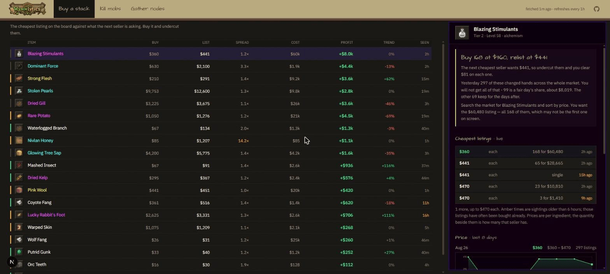
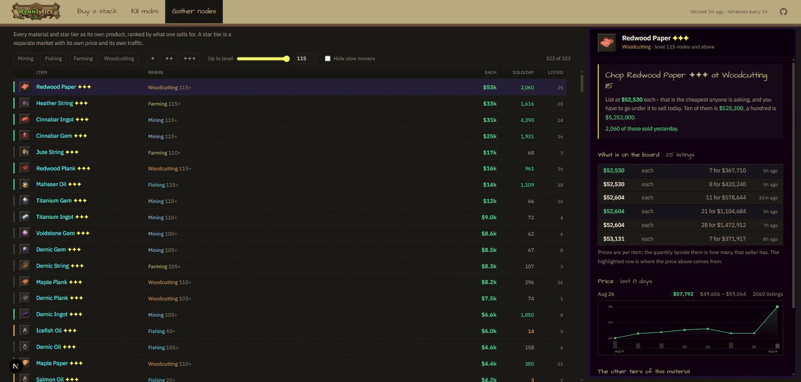

<div align="center">


**What to buy, kill and gather on the Wynncraft trade market — ranked by what it actually pays.**

</div>

---

Three questions, three tabs. Every row says what to do and what it pays; open
one and it shows the order book, the price history and where the thing comes
from.

| | | |
|---|---|---|
| **Buy a stack** | Someone listed a stack under what the next seller is asking. Buy it, undercut them. | `BUY $360 → LIST $441 · +$8.0k` |
| **Kill mobs** | A drop worth more than the trip, with the coordinates of what drops it. | `Stolen Pearls · Tribal Exile 1488, 113, -1513` |
| **Gather nodes** | Every material and star tier as its own product, filtered to what your professions can reach. | `Redwood Paper ✦✦✦ · Woodcutting 115 · $53k` |



## The data is uneven, and the board says so

Prices come from [WynnVentory](https://www.wynnventory.com) — players running a
mod who upload what they see while browsing the market. Nobody browses at 4am,
so the board thins out overnight and fills back up in the evening.

That is treated as a normal condition rather than an error:

- **Every figure carries its age.** `SEEN` turns amber past six hours, because a
  cheap listing that old has usually been bought already.
- **A stale row is discounted, not hidden.** It ranks below anything current
  instead of vanishing, so a quiet night leaves you a worse board rather than an
  empty one.
- **A falling market ranks lower than its headline number.** A `+$4.4k` sitting
  on `-46%` is not the same trade as `+$4.4k` on `0%`.
- **When there is genuinely nothing, it says which kind of nothing** — your
  filters excluded everything, or the market is quiet.
- **Snapshots merge, never overwrite.** Refetching at a dead hour adds what it
  finds and keeps the rest.



## Running it

```bash
pnpm install
pnpm dev
```

`WYNNVENTORY_KEY` in `.env.local` unlocks the listings endpoint. Without it the
site still runs, falling back to the committed snapshots under `src/data/`.

## How it stays fresh

Two layers, and only one looks after itself.

**Live** — the page is ISR and regenerates at most hourly, on the first visit
after the window expires; opening an item re-checks that one item with no cache.
Nothing to schedule.

**The committed fallback** — `src/data/*.json` is baked into the deploy and would
otherwise age forever, which matters because it is exactly what the board falls
back to when the feed is quiet. Two workflows refetch it and push only when
something moved, which redeploys:

| workflow | when | why that often |
|---|---|---|
| `refresh-data.yml` | every 6h | listings change all day; a run is ~470 quick calls and finishes in under a minute |
| `refresh-history.yml` | daily, 03:41 | history is daily data and each call is ~4.5s |

Both need `WYNNVENTORY_KEY` as a repository secret. Run either by hand from the
Actions tab.

To refresh by hand:

```bash
pnpm build:listings   # ingredient listings
pnpm build:gather     # material listings, per star tier
pnpm build:charts     # price history
pnpm build:icons      # sprites into public/icons
```

## Deploying

Vercel, from this repo. One environment variable:

| name | where |
|---|---|
| `WYNNVENTORY_KEY` | Project → Settings → Environment Variables, all three environments |

Node 22 or newer (`engines`). pnpm is the package manager — `pnpm-lock.yaml` is
the only lockfile, deliberately, and `packageManager` pins the version so CI
resolves it without being told.

`revalidate` lives in `src/lib/refresh.ts` so the page window, the price-fetch
TTL and the label in the header cannot disagree. Next takes the lowest of a
route's `revalidate` and any fetch inside it, so the first two have to be equal —
the comment there explains what breaks otherwise.

`scripts/` sits outside the app's `tsconfig.json` on purpose: it is build-time
tooling, and a type error in a data downloader should not stop a deploy of
working app code. Check it on its own with `pnpm typecheck:scripts`.

## Layout

```
src/app/          the page, the layout, two debug API routes
src/components/   the board, the ledger table, the two detail panels
src/lib/          scoring, market clients, formatting, the board assembler
src/data/         committed snapshots — prices, history, drops, icon index
scripts/          the downloaders that write src/data and public/icons
notes/            why things are the way they are
```

`notes/` holds the durable context: `memory/` for what must survive into the
next session, `decisions/` for why a choice was made, `journal/` for what
happened on a given day.

## Credit

Prices and listings from [WynnVentory](https://www.wynnventory.com). Item and
mob data from the [official Wynncraft API](https://docs.wynncraft.com). Item
sprites from Wynncraft's item guide; the currency marks for emerald, block,
liquid emerald and stack are the game's own. Not affiliated with Wynncraft.
